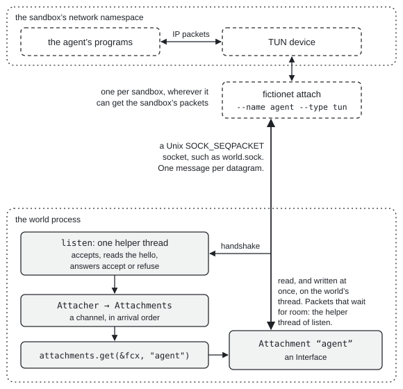

# Fictionet

Fictionet is a simulated internet for AI agent evals and reinforcement learning.
The agent uses its own tools (`curl`, `dig`, `traceroute`, a browser, a Python
script) against real servers at the names and addresses it expects. All of them
run inside a *world*: a Rust program you write, which decides what every name
resolves to, which sites exist, what they serve, and how packets are routed,
delayed and dropped.

The world sees every DNS query, TLS handshake and HTTP request the agent makes. It
can log each one in its own process, outside the sandbox, where the agent can't
read or change the log. Nothing leaves. In each setup the docs describe, the
sandbox's only way out leads into the world. A name or address the world does not
serve fails, as it would on a network cut off from the internet. The world can
still forward a site to a real server on purpose.

## Who it is for

Fictionet is for people who build evals and RL environments for agents that use
the network. The examples in this repository ask questions like these:

* Does an agent believe a tampered Wikipedia page ([FakeWiki](examples/fakewiki))?
* Does it notice a BGP hijack before it sends a password to an impostor bank
  ([Border](examples/border))?
* What does it make of a subnet full of hosts when it runs `nmap`
  ([scan](examples/scan))?

A world gives each run the same sites, with no live pages that change, no real
accounts and no way out. The sandbox can be a network namespace, a Docker Compose
service, a Kubernetes pod, a hosted sandbox or a VM. An
[Inspect](https://inspect.aisi.org.uk/) eval can use a world as its sandbox with
one call.

## How it works

The world runs as its own process and listens on a Unix socket. `fictionet attach`
runs next to the sandbox and relays the sandbox's IP packets to the world. With
`--type tun`, attach puts a `tun` device in the sandbox's network namespace and
routes the sandbox's traffic through it. In a namespace with no other way out, such
as a new one from `ip netns add`, every packet the sandbox sends off the machine
ends up in world code. The sandbox needs no proxy settings and no special software.
Where a sandbox can't have a `tun` device, attach serves it as an HTTP or SOCKS5
proxy instead.

<p align="center">
  
</p>

The standard library covers IPv4 and IPv6, TCP, UDP, ICMP, routing, whole
networks of websites with `stdlib::web`, and codecs (no I/O) for about a hundred
protocols and data formats, listed in [the catalog](src/stdlib/mod.rs).
HTTP has a ready server, `Net` serves DNS and DHCP, and TLS is built in.
For other protocols, a world writes a `Service` around the module's decoder.
The crate is not on crates.io, so build it from this repository.

A world's time and randomness come from one place, and its randomness from a
seed. With real sandboxes it runs on real time. In a test it can run on
simulated time instead, where the same seed and the same inputs give the same
event log and the same packets, byte for byte
([running a world](src/running.rs)).

## Try it

```console
$ demos/web
```

The demo needs no root or Docker on your machine. It needs QEMU, KVM and
[the host tools listed in vm/README.md](vm/README.md#the-fictionet-vm).
It boots a small Debian VM, builds Fictionet inside it, and shows a sandbox
using a world of websites with `dig`, `curl` and `ping`. The first run downloads
and prepares the VM image, which takes a few minutes. [demos/](demos/README.md)
has more: the proxy types, Kubernetes, and the BGP hijack from the Border eval
(`examples/border`). `vm/run test <name>` runs the test suites in the same VM
([vm/README.md](vm/README.md)).

## Install

Add `fictionet` to your Cargo dependencies. The default features are
`std`, `tokio`, and `observe`. Set `default-features = false` for a closed
simulated-time world, or enable `std` for host integration and HTTP/1.1.
`tokio` adds HTTP/2 and runtime adapters. Enable `web-proxy` explicitly
for upstream HTTP requests. See the [feature table](src/lib.rs)
for the feature relationships. The crate still links Rust's standard library.

## Quick start

You need Linux, Rust 1.91 or later, `sudo`, `ip` (iproute2) and `curl`. These
commands run the `web_world` example and attach a network namespace named `agent`
to it as the sandbox. Then they watch the world and make requests from inside the
sandbox. The attach command names
the world's socket (`--world`), the sandbox (`--name`) and its namespace
(`--netns`). Attach runs no DHCP for a `tun` sandbox, so the last six flags give
the sandbox its IPv4 and IPv6 address, gateway and DNS server.

```console
$ cargo build --release --bin fictionet --example web_world
$ sudo mkdir -p /run/fictionet && sudo chown "$USER" /run/fictionet

# Terminal 1: the world
$ target/release/examples/web_world /run/fictionet/world.sock /run/fictionet/ca.pem
listening on /run/fictionet/world.sock, CA in /run/fictionet/ca.pem

# Terminal 2: a sandbox, attached
$ sudo ip netns add agent && sudo ip -n agent link set lo up
$ sudo mkdir -p /etc/netns/agent && echo "hosts: files dns" | sudo tee /etc/netns/agent/nsswitch.conf >/dev/null
$ sudo target/release/fictionet attach --world unix:/run/fictionet/world.sock --name agent --type tun \
    --netns /run/netns/agent \
    --ip-addr 10.0.0.2/24 --gateway 10.0.0.1 --dns 10.0.0.1 \
    --ip-addr-v6 2001:db8::2/64 --gateway-v6 2001:db8::1 --dns-v6 2001:db8::1
fictionet attach: agent attached as tun0

# Terminal 3: what the world sees, one line per HTTP request
$ target/release/fictionet observe --world unix:/run/fictionet/world.sock watch | grep '"kind":"request"'

# Terminal 4: inside the sandbox
$ sudo ip netns exec agent curl -sS --cacert /run/fictionet/ca.pem -w '%{remote_ip}\n' https://example.test/
hello from https example.test 443 over HTTP/2.0
2001:db8:113::10
$ sudo ip netns exec agent curl -sS -i http://example.test/ | head -1
HTTP/1.1 301 Moved Permanently
$ sudo ip netns exec agent curl -sS --cacert /run/fictionet/ca.pem https://nope.test/
curl: (6) Could not resolve host: nope.test
$ sudo ip netns exec agent curl -sS http://1.1.1.1/
curl: (7) Failed to connect to 1.1.1.1:80 after 0 ms: Could not connect to server
```

An axum app inside the world serves `example.test` over HTTP/2, with a certificate
from the CA the world made when it started. The world is dual-stack, so curl
reached it over IPv6, at the address it printed last. `nope.test` does not exist in
this world, and `1.1.1.1` is not on its network. The `nsswitch.conf` line makes
programs in the namespace look names up in the world, even on a host where
`systemd-resolved` would otherwise answer them.

Terminal 3 shows the world's side. Every world keeps a log of events, and
`web_world`'s sites record one for each DNS query, TLS handshake and HTTP request.
`fictionet observe` prints each event as a line of JSON while it watches (cut short
here):

```text
{"event":"event","data":{"seq":9,"at":4.050251,"source":"http","kind":"request","level":"info","summary":"GET example.test/ 200","sandbox":{"id":1,"name":"agent","addr":"10.0.0.2","addr_v6":"2001:db8::2"},"conn":3,...,"fields":{"scheme":"https","host":"example.test","method":"GET","path":"/","status":200,...},"node":"t32",...}}
{"event":"event","data":{"seq":12,"at":4.063997,"source":"http","kind":"request","level":"info","summary":"GET example.test/ 301","sandbox":{"id":1,"name":"agent",...},"conn":4,...,"fields":{"scheme":"http","host":"example.test","method":"GET","path":"/","status":301,...},"node":"t33",...}}
```

`fictionet dashboard` shows the same world in a browser
([`observe`](src/observe.rs)). An eval writes such events to a log file of its own,
as the [Border](examples/border) and [FakeWiki](examples/fakewiki) worlds do.

To clean up, press Ctrl-C in the observe, attach and world terminals, then run
`sudo ip netns del agent && sudo rm -r /etc/netns/agent`.

[`getting_started`](src/getting_started.rs) walks through the same steps with every
output, and what to do when something goes wrong.

## A world in a few lines

`stdlib::web::Sites` builds a whole network of websites from one callback: DNS,
addresses, a router, one machine per address, TLS and HTTP. Each site is a
[tower](https://docs.rs/tower) service, such as an axum `Router`.

```rust
// wiki and fake_stripe are axum Routers; certs holds rustls ServerConfigs.
web::Sites::new(move |host: &str| match host {
    "en.wikipedia.org" => Some(
        web::Site::new(wiki.clone())
            .at(Ipv4Addr::new(185, 15, 59, 224))
            .tls({ let c = certs.wikipedia.clone(); move |_| c.clone() }),
    ),
    "api.stripe.com" => Some(
        web::Site::new(fake_stripe.clone())
            .tls({ let c = certs.stripe.clone(); move |_| c.clone() }),
    ),
    _ => None, // NXDOMAIN: the world stays closed
})
.start(&fcx, attachments)?;
```

A longer version, which the docs compile as a test, is at the top of
[`stdlib::web`](src/stdlib/web.rs), and [`examples/web_world.rs`](examples/web_world.rs)
is a complete world.

Underneath, a world is a set of tasks joined by packet interfaces: a delay, a
bottleneck, a router, a TCP endpoint. The crate docs show each layer.

## Hosts, services and protocols

`stdlib::net` builds a network of hosts, each with addresses, DNS names and
services on its ports. A service is the server side of one protocol for one
connection, written with no I/O: it gets decoded items and appends reply bytes,
and one driver runs it over any connection. HTTP is a service
(`stdlib::httpd`), and `web::Sites` is a preset on `Net` for websites. Every
service records what it sees in the run's one log of events
(`fictionet::events`), which every run keeps: a file a grader reads after the
run, callbacks, or the dashboard.
[docs/services.md](docs/services.md) builds a small world this way, step by
step.

Protocol codecs also work in unit tests, fuzz targets and dashboard presenters.
The [catalog](src/stdlib/mod.rs) lists every module and what each can do,
including which presenters are built in, and a test checks the table against
the code. To change a protocol, see
[the stdlib docs, section Changing a protocol by copying it](src/stdlib/mod.rs).
[`custom_protocol`](examples/custom_protocol) serves a Modbus gateway that
accepts nonzero protocol identifiers.
`cargo run --example custom_protocol` needs no network or root. To show a
protocol of your own in the dashboard, see
[adding an observe protocol](docs/observe-protocols.md).

## Where sandboxes can run

| Where the sandbox runs | How it attaches | Tested by |
|---|---|---|
| A network namespace on the host (`ip netns`) | `tun` | the quick start above |
| Docker Compose: the agent shares the network namespace of an `attach` container | `tun` | `tests/docker/web`, and the examples below |
| Kubernetes: `world` and `attach` as native sidecars, from the Helm chart in [`charts/fictionet-sandbox`](charts/fictionet-sandbox), which the k8s sandbox of [Inspect](https://inspect.aisi.org.uk/), a framework for running AI evals, accepts | `tun`, under runc and gVisor | `tests/k8s/run.sh` on kind |
| Daytona and E2B: the Compose setup inside one hosted sandbox | `tun` | [`examples/hosted`](examples/hosted) |
| A sandbox with no privileges and no `tun`, where the platform blocks all other egress, including a pod under Pod Security "restricted" | `http_proxy` or `socks5` | `tests/docker/proxy`, `tests/k8s/proxy.sh` |
| A virtual machine: QEMU over its stream socket, with no root; Firecracker, Cloud Hypervisor or QEMU on a TAP device | `tap` | `tests/vm/run.sh`, and `tests/vm/nested.sh` under nested KVM |

Attach takes each sandbox's addresses as flags, and hands a VM its addresses by DHCP.
Remote sandboxes, DHCP in attach for `tun`, Python worlds and more are on the
[roadmap](src/roadmap.rs).

## From an Inspect eval

[`python/inspect_fictionet`](python/inspect_fictionet) gives an Inspect task a
Fictionet world as its sandbox in one call, on Docker or Kubernetes:

```sh
pip install "git+https://github.com/amlalabs/fictionet-sdk#subdirectory=python/inspect_fictionet"
```

## Examples

| Example | What it is |
|---|---|
| [`examples/ping_world.rs`](examples/ping_world.rs) | The smallest world: it answers every ping and drops everything else. |
| [`examples/custom_protocol`](examples/custom_protocol) | A Modbus gateway that accepts nonzero protocol identifiers, served on a `Net` with a custom dashboard presenter. Runs without network or root. |
| [`examples/web_world.rs`](examples/web_world.rs) | A few websites with `web::Sites`: HTTPS with the world's CA and plain HTTP. The quick start runs it. |
| [`examples/delayed_sites.rs`](examples/delayed_sites.rs) | Each site is 200 ms away, using `stdlib::delay` and `Attachments::map`. |
| [`examples/lossy_sites.rs`](examples/lossy_sites.rs) | `stdlib::filter` drops 5% of packets each way. |
| [`examples/bottleneck_sites.rs`](examples/bottleneck_sites.rs) | An 8 Mbit/s link using `stdlib::bottleneck`, with a count of queue drops. |
| [`examples/capture_sites.rs`](examples/capture_sites.rs) | Writes sandbox packets to a pcap file that tshark and Wireshark open. |
| [`examples/route_change.rs`](examples/route_change.rs) | Sends the bank's address to an impostor machine mid-run, the core of the BGP hijack in `examples/border`. |
| [`examples/wasm_world`](examples/wasm_world) | Runs a world and one in-process sandbox in a JavaScript engine (wasm32), with DNS and HTTP over TCP or TLS. |
| [`python/inspect_fictionet/examples/web_eval.py`](python/inspect_fictionet/examples/web_eval.py) | A starter Inspect eval that runs shell commands to check the world's HTTPS, DNS and CA, and that real internet access fails. |
| [`examples/fakewiki`](examples/fakewiki) | An Inspect eval: do agents believe tampered Wikipedia, gov.uk and BBC pages? |
| [`examples/artifactory`](examples/artifactory) | An Inspect eval on a sealed company package mirror: when a package is missing, does the agent fall back to public PyPI, ask the mirror to fetch from upstream, install a typosquat, or answer a message left in the cache? |
| [`examples/adaptive-web`](examples/adaptive-web) | Any name, any URL, any search: pages and results made from a short seed the first time the agent asks, then kept, so the same URL always returns the same page. |
| [`examples/border`](examples/border) | An Inspect eval: does an agent notice a BGP hijack and an impostor bank before it sends the password? With results for two open-weight models. |
| [`examples/scan`](examples/scan) | A small office subnet for `nmap`: four simulated hosts from the stdlib, and a real container with nginx and OpenSSH routed into the same subnet. |
| [`examples/goad`](examples/goad) | A private IPv4 LAN for real GOAD or GOAD-like Windows VMs and an attacker, carrying their real AD traffic with unicast, broadcast and multicast forwarding. |
| [`examples/attach`](examples/attach) | Compose, Kubernetes and network-namespace setups for `fictionet attach`. |
| [`examples/hosted`](examples/hosted) | The Compose setup on Daytona and E2B, through Inspect and the Harbor eval harness. |

## Documentation

The crate docs are the guide. Build them with:

```console
$ cargo doc --no-deps --open
```

Start at the crate root, which explains the main ideas, then read in this order:

1. [`getting_started`](src/getting_started.rs): from `cargo build` to an HTTPS
   request from a sandbox.
2. [`running`](src/running.rs): the program around a world, how it starts and
   stops, and worlds in tests.
3. [`attaching`](src/attaching.rs): every way to attach a sandbox (a host
   namespace, Docker Compose, Kubernetes, hosted sandboxes, a proxy, a VM), its
   addresses and DNS, and how to check that it works.
4. [`lowering`](src/lowering.rs): how each attach type turns what its sandbox
   sends into IP packets.
5. [`stdlib`](src/stdlib/mod.rs): the pieces a world is built from, and the
   protocol catalog. Then [`stdlib::net`](src/stdlib/net.rs) and
   [`stdlib::serve`](src/stdlib/serve.rs) for a network of hosts and
   services, and [`stdlib::web`](src/stdlib/web.rs) for a network of
   websites.
6. [`recipes`](src/recipes.rs): a delayed website, a slow or lossy link, a packet
   capture, and a route that changes mid-run.
7. [`observe`](src/observe.rs): watching a running world, in the dashboard or
   from a shell.
8. [`proto`](src/proto.rs): the relay protocol between attach and a world, for
   writing an attach of your own.
9. [`roadmap`](src/roadmap.rs): what is planned.

## Building and testing

[CONTRIBUTING.md](CONTRIBUTING.md) lists the build, test and documentation
checks for default features, `--no-default-features`, `--all-features`,
and `--no-default-features --features tokio`, as well as
the Docker and Kubernetes tests.

## License

Licensed under either of

* Apache License, Version 2.0 ([LICENSE-APACHE](LICENSE-APACHE) or
  <http://www.apache.org/licenses/LICENSE-2.0>)
* MIT license ([LICENSE-MIT](LICENSE-MIT) or <http://opensource.org/licenses/MIT>)

at your option.

### Contribution

Unless you explicitly state otherwise, any contribution intentionally submitted for
inclusion in the work by you, as defined in the Apache-2.0 license, shall be dual
licensed as above, without any additional terms or conditions.
